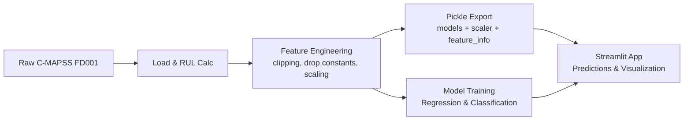

# NASA Turbofan Engine Degradation – RUL Prediction

> Streamlit app for predicting Remaining Useful Life (RUL) of turbofan engines using the NASA C-MAPSS FD001 dataset. 
> Live App: https://nasa-turbofan-engine-degradation-simulation.streamlit.app

## What’s inside
- Interactive Streamlit frontend (EDA, feature engineering, regression/classification models, comparisons, predictions)
- Ready-to-run notebook with the full ML pipeline
- Pre-trained model pickles + scaler for quick inference
- Data download automated via KaggleHub

# run the app
streamlit run app.py

## Data
- Dataset: NASA C-MAPSS FD001 (Kaggle)  
  https://www.kaggle.com/datasets/behrad3d/nasa-cmaps
- Data is pulled automatically on first run via KaggleHub. If download is blocked, download manually from Kaggle and place under `~/.cache/kagglehub/datasets/behrad3d/nasa-cmaps/CMaps`.

## App pages
- **Home**: overview, links, author, dataset info
- **Data Overview**: load data, preview, stats, missing checks, lifetime histograms
- **EDA**: correlations, sensor evolution, sensor vs RUL, distributions
- **Feature Engineering**: RUL calc, clipping, constant feature removal
- **Regression Models**: Linear Regression, SVR, Random Forest, XGBoost (with metrics/plots)
- **Classification Models**: SVC, RF, Naive Bayes, KNN (with confusion matrices/report)
- **Model Comparison**: side-by-side charts for regression and classification
- **Predictions**: manual, CSV upload, or validation sample; supports pickled models
- **Performance Analysis**: error and metric breakdowns

## Architecture level

## Repository layout
- `app.py` — Streamlit frontend
- `nasa-predictive-maintenance-rul.ipynb` — full exploratory notebook
- `models/` — pre-trained pickles (scaler, models, feature_info)
- `requirements.txt` — app dependencies

## Notes for Streamlit Cloud
- Ensure `requirements.txt` is present in the repo root.

## Author
Built by **Yash Joshi**. Feel free to reach out with feedback or issues.
